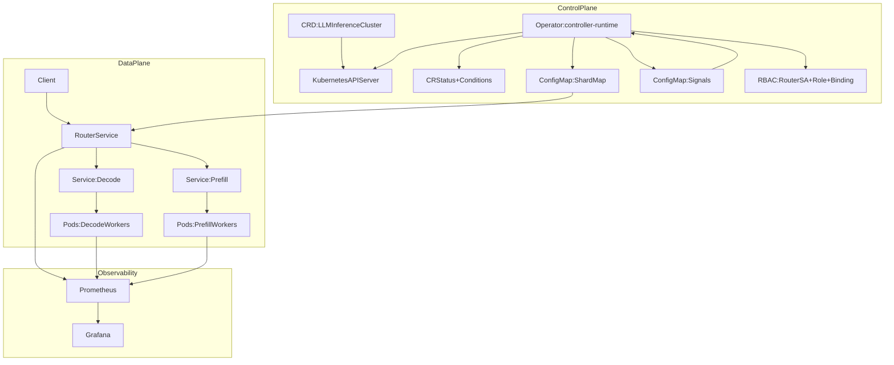

## LLM Inference Operator (v1)

Kubernetes operator that manages an `LLMInferenceCluster` and provides **KV-aware routing semantics** via a Router service plus a published shard map.

### Tech stack

[](https://go.dev/)
[](https://kubernetes.io/)
[](https://book.kubebuilder.io/)
[](https://github.com/kubernetes-sigs/controller-runtime)
[](https://prometheus.io/)
[](https://grafana.com/)
[](https://kind.sigs.k8s.io/)

This repo’s v1 is intentionally **kind/minikube friendly** (no GPUs required) and uses a lightweight **mock worker** to make the full control-plane + routing loop demonstrable on a laptop.

### Architecture (control plane vs data plane)



### What you get in v1 (local, mock-friendly)

- **CRD + controller-runtime reconciler**: creates/patches Deployments/Services/ConfigMaps, updates status + conditions, uses a finalizer.
- **Prefill vs decode split**: separate Services/Deployments for each role.
- **KV shard metadata plane**:
  - Operator publishes `*-shardmap` ConfigMap (`shardmap.json`).
  - Operator also publishes `status.shards[]` with shard ownership.
- **KV-aware routing surface**:
  - Router reads shard map from the ConfigMap, applies **session affinity** (`conversationId → shard`), and forwards to decode.
  - Router injects `X-Conversation-Id` and `X-KV-Shard` headers (mock worker echoes them back).
- **Autoscaling signals (mocked)**:
  - When `spec.autoscaling.enabled=true`, operator reads `*-signals` ConfigMap and scales **decode** replicas.
- **Observability**:
  - Router + mock worker expose Prometheus metrics.
  - `deploy/observability/` provides Prometheus + Grafana for kind.

### What the same architecture is meant to do in production

Even though v1 uses mocks, the control-plane shapes are designed to map directly to a real GPU deployment:

- **Inference runtime**: replace the mock worker image with **vLLM** (or TensorRT-LLM) pods, and (optionally) add Triton for multi-model.
- **GPU layer**: run on nodes managed by **NVIDIA GPU Operator + Device Plugin**; optionally use **MIG** for partitioning.
- **Signals**: switch from fake ConfigMap signals to a **Prometheus-based signals adapter** scraping real metrics:
  - vLLM metrics (tokens/sec, queue depth, cache events)
  - DCGM/NVML exporter (GPU memory/utilization pressure)
  - router latency + shard distribution
- **Autoscaling**: drive scaling using **KEDA** (or an operator-owned scaler) on tokens/sec, queue depth, KV hit rate, and GPU memory pressure.
- **Routing correctness**: router maintains stable session affinity and routes to the correct shard owner across rollouts/reschedules (in production, this often becomes **direct-to-pod** or shard-aware endpoint selection).
- **Memory pressure handling**: decode workers report OOM risk; operator triggers eviction/rebalance and updates shard ownership with minimal disruption.

## Quickstart (kind)

Prereqs:
- `docker`, `kubectl`, `kind`
- `kubebuilder` (for generating CRDs locally)

Create a kind cluster:

```bash
./hack/kind-create.sh
```

Build & load images into kind:

```bash
./hack/kind-load-images.sh
```

Install CRDs + deploy operator:

```bash
./hack/install-kind.sh
```

Apply the sample cluster:

```bash
kubectl apply -f config/samples/inference_v1alpha1_llminferencecluster.yaml
```

Port-forward the router and call it:

```bash
kubectl port-forward svc/llminferencecluster-sample-router 8080:8080
curl -s -X POST localhost:8080/v1/chat/completions -H 'content-type: application/json' \
  -d '{"conversationId":"demo-1","messages":[{"role":"user","content":"hi"}]}' | jq .
```

Simulate queue pressure to trigger decode scaling:

```bash
kubectl patch configmap llminferencecluster-sample-signals -p '{"data":{"queueDepth":"250"}}'
kubectl get deploy llminferencecluster-sample-decode -w
```

## Observability (Prometheus/Grafana)

```bash
kubectl apply -f deploy/observability/prometheus.yaml
kubectl apply -f deploy/observability/grafana.yaml
kubectl -n llm-observability port-forward svc/grafana 3000:3000
```

Grafana should be available at `http://localhost:3000` with an auto-provisioned Prometheus datasource.

# llm-inference-operator
// TODO(user): Add simple overview of use/purpose

## Description
// TODO(user): An in-depth paragraph about your project and overview of use

## Getting Started

### Prerequisites
- go version v1.24.6+
- docker version 17.03+.
- kubectl version v1.11.3+.
- Access to a Kubernetes v1.11.3+ cluster.

### To Deploy on the cluster
**Build and push your image to the location specified by `IMG`:**

```sh
make docker-build docker-push IMG=<some-registry>/llm-inference-operator:tag
```

**NOTE:** This image ought to be published in the personal registry you specified.
And it is required to have access to pull the image from the working environment.
Make sure you have the proper permission to the registry if the above commands don’t work.

**Install the CRDs into the cluster:**

```sh
make install
```

**Deploy the Manager to the cluster with the image specified by `IMG`:**

```sh
make deploy IMG=<some-registry>/llm-inference-operator:tag
```

> **NOTE**: If you encounter RBAC errors, you may need to grant yourself cluster-admin
privileges or be logged in as admin.

**Create instances of your solution**
You can apply the samples (examples) from the config/sample:

```sh
kubectl apply -k config/samples/
```

>**NOTE**: Ensure that the samples has default values to test it out.

### To Uninstall
**Delete the instances (CRs) from the cluster:**

```sh
kubectl delete -k config/samples/
```

**Delete the APIs(CRDs) from the cluster:**

```sh
make uninstall
```

**UnDeploy the controller from the cluster:**

```sh
make undeploy
```

## Project Distribution

Following the options to release and provide this solution to the users.

### By providing a bundle with all YAML files

1. Build the installer for the image built and published in the registry:

```sh
make build-installer IMG=<some-registry>/llm-inference-operator:tag
```

**NOTE:** The makefile target mentioned above generates an 'install.yaml'
file in the dist directory. This file contains all the resources built
with Kustomize, which are necessary to install this project without its
dependencies.

2. Using the installer

Users can just run 'kubectl apply -f <URL for YAML BUNDLE>' to install
the project, i.e.:

```sh
kubectl apply -f https://raw.githubusercontent.com/<org>/llm-inference-operator/<tag or branch>/dist/install.yaml
```

### By providing a Helm Chart

1. Build the chart using the optional helm plugin

```sh
kubebuilder edit --plugins=helm/v2-alpha
```

2. See that a chart was generated under 'dist/chart', and users
can obtain this solution from there.

**NOTE:** If you change the project, you need to update the Helm Chart
using the same command above to sync the latest changes. Furthermore,
if you create webhooks, you need to use the above command with
the '--force' flag and manually ensure that any custom configuration
previously added to 'dist/chart/values.yaml' or 'dist/chart/manager/manager.yaml'
is manually re-applied afterwards.

## Contributing
// TODO(user): Add detailed information on how you would like others to contribute to this project

**NOTE:** Run `make help` for more information on all potential `make` targets

More information can be found via the [Kubebuilder Documentation](https://book.kubebuilder.io/introduction.html)

## License

Copyright 2026.

Licensed under the Apache License, Version 2.0 (the "License");
you may not use this file except in compliance with the License.
You may obtain a copy of the License at

    http://www.apache.org/licenses/LICENSE-2.0

Unless required by applicable law or agreed to in writing, software
distributed under the License is distributed on an "AS IS" BASIS,
WITHOUT WARRANTIES OR CONDITIONS OF ANY KIND, either express or implied.
See the License for the specific language governing permissions and
limitations under the License.

